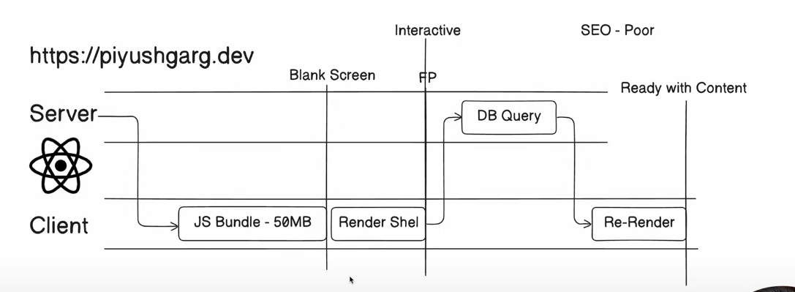
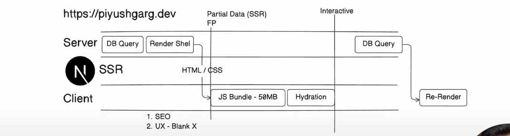
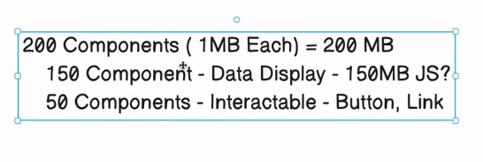
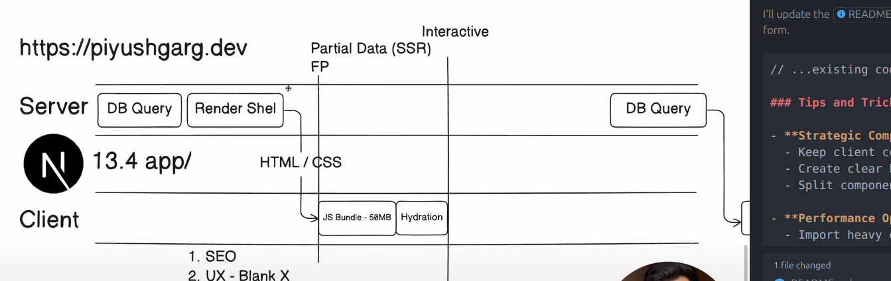

This is a [Next.js](https://nextjs.org) project bootstrapped with [`create-next-app`](https://nextjs.org/docs/app/api-reference/cli/create-next-app).

## Understanding Server and Client Components

### Server Components (Default in Next.js 13+)

Server components are rendered on the server and sent to the client as HTML. They:

- Cannot use browser APIs or React hooks (useState, useEffect, etc.)
- Cannot respond to user interactions directly
- Can directly access backend resources (databases, file systems)
- Reduce JavaScript sent to the client, improving performance
- Are great for static content, data fetching, and SEO

### Client Components

Client components are hydrated in the browser and can use client-side interactivity. To use a client component, add `"use client"` at the top of your file. They:

- Can use browser APIs and React hooks
- Can handle user interactions (clicks, form submissions)
- Cannot directly access backend resources
- Send more JavaScript to the client
- Are ideal for interactive UI elements like forms, buttons, and animations

### When to use "use client"

Add `"use client"` at the top of your file when you need:

- Interactive features (useState, useEffect)
- Event listeners (onClick, onChange)
- Browser-only APIs (localStorage, navigator)
- Client-side libraries that depend on browser features

Keep components as server components when possible for better performance, and only use client components when interactivity is needed.

### Tips and Tricks for Using "use client"

- **Strategic Component Organization**
  - Keep client components at the "leaves" of your component tree (UI elements that need interactivity)
  - Create clear boundaries between server and client components
  - Split components into server/client pairs when needed

- **Performance Optimization**
  - Import heavy dependencies only in client components
  - Use dynamic imports (`next/dynamic`) for large client-side libraries
  - Server components can be used within client components (creates "server islands")

- **Common Patterns**
  - Wrap providers (context, theme) with "use client" and place at the root
  - Create "interactivity islands" - small client components in mainly server component pages
  - Use shared utility functions that work in both environments

- **Avoiding Common Pitfalls**
  - Don't use hooks in server components
  - Don't import client components in server components without "use client"
  - Check for browser environment before using browser APIs: `if (typeof window !== 'undefined')`

- **Data Handling**
  - Fetch data in server components when possible
  - Pass data down to client components as props
  - Use React Context in client components for state that needs to be shared
  - Consider server actions for form submissions

- **Debugging**
  - Watch console errors for hook usage in server components
  - Look for hydration errors which may indicate client/server component mismatches
  - Use React DevTools to inspect component hierarchies

  - **Images**
  - 

  - **NextJS-PageRouter**
    

    **NextJS-Optimization-PageRouter**
    

    **NextJS-Optimization-PageRouter**
    

## Getting Started

First, run the development server:

```bash
npm run dev
# or
yarn dev
# or
pnpm dev
# or
bun dev
```

Open [http://localhost:3000](http://localhost:3000) with your browser to see the result.

You can start editing the page by modifying `app/page.tsx`. The page auto-updates as you edit the file.

This project uses [`next/font`](https://nextjs.org/docs/app/building-your-application/optimizing/fonts) to automatically optimize and load [Geist](https://vercel.com/font), a new font family for Vercel.

## Learn More

To learn more about Next.js, take a look at the following resources:

- [Next.js Documentation](https://nextjs.org/docs) - learn about Next.js features and API.
- [Learn Next.js](https://nextjs.org/learn) - an interactive Next.js tutorial.

You can check out [the Next.js GitHub repository](https://github.com/vercel/next.js) - your feedback and contributions are welcome!

## Deploy on Vercel

The easiest way to deploy your Next.js app is to use the [Vercel Platform](https://vercel.com/new?utm_medium=default-template&filter=next.js&utm_source=create-next-app&utm_campaign=create-next-app-readme) from the creators of Next.js.

Check out our [Next.js deployment documentation](https://nextjs.org/docs/app/building-your-application/deploying) for more details.
